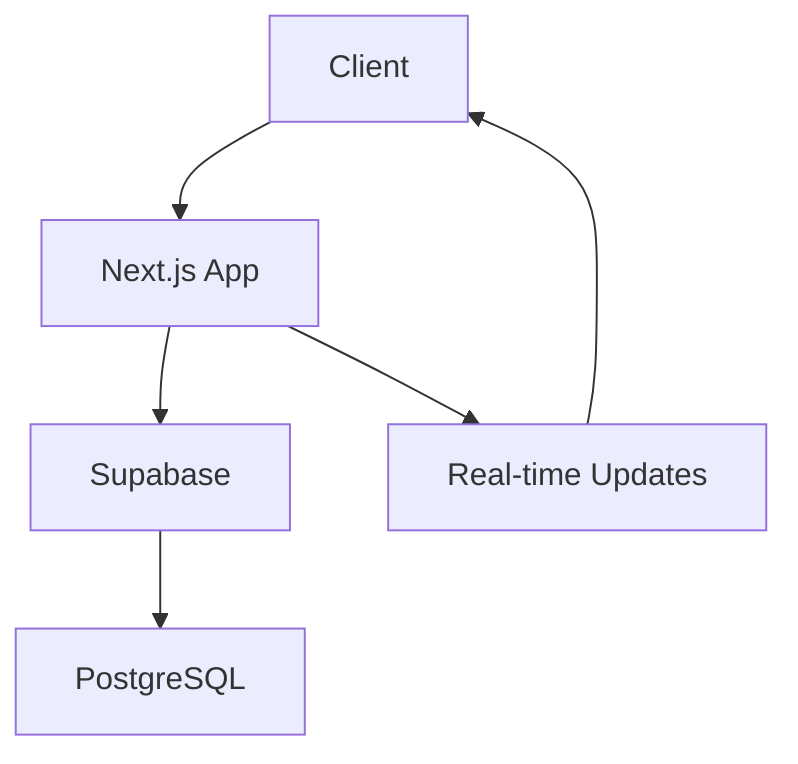

# ☕ Next.js Coffee Shop POS

[](https://nextjs.org/)
[](https://www.typescriptlang.org/)
[](https://supabase.com/)
[](https://tailwindcss.com/)
[](LICENSE)

> Modern Point of Sale system for coffee shops with real-time order management, secure authentication, and responsive design.

## ✨ Features

- 🔄 **Real-time order tracking** with Supabase integration
- 🔐 **Secure authentication** and role-based access control
- 📱 **Responsive design** - works on desktop and mobile
- 🎨 **Modern UI** built with Radix UI and Tailwind CSS
- ⚡ **Fast performance** with Next.js App Router
- 📊 **Order analytics** and history tracking
- 🔍 **Product search** and filtering
- 💳 **Payment processing** ready

## 🚀 Tech Stack

- **Frontend**: Next.js 14, React, TypeScript
- **Backend**: Supabase (PostgreSQL, Auth, Real-time)
- **Styling**: Tailwind CSS, Radix UI
- **State Management**: React Context
- **Testing**: Jest, React Testing Library
- **Deployment**: Vercel

## 📁 Project Structure
```
├── app/                      # Next.js app directory with route handlers and pages
│   ├── api/                 # API routes for products, debugging, and authentication
│   ├── auth/                # Authentication-related pages and routes
│   └── profile/            # User profile management pages
├── components/              # Reusable React components
│   ├── auth/               # Authentication-related components
│   ├── order/             # Order management components
│   └── ui/                # Shared UI components built with Radix UI
├── contexts/               # React context providers for auth and orders
├── hooks/                  # Custom React hooks
├── lib/                    # Utility functions and API clients
└── styles/                 # Global styles and Tailwind CSS configuration
```

## 🛠️ Getting Started

### Prerequisites
- Node.js 16.x or higher
- pnpm package manager
- Supabase account and project
- Environment variables configured in `.env.local`:
  ```
  NEXT_PUBLIC_SUPABASE_URL=your-supabase-url
  NEXT_PUBLIC_SUPABASE_ANON_KEY=your-supabase-anon-key
  ```

### Installation
```bash
# Clone the repository
git clone https://github.com/ccmelvin/pos-coffee-shop.git
cd pos-coffee-shop

# Install dependencies
pnpm install

# Set up environment variables
cp .env.example .env.local
# Edit .env.local with your Supabase credentials

# Start development server
pnpm dev
```

Open [http://localhost:3000](http://localhost:3000) in your browser.

## 📖 Usage Examples

### Authentication
1. Sign in or create an account:
```typescript
// Using the auth form
import { LoginForm } from '@/components/auth/login-form';

// Example usage
<LoginForm onSuccess={() => router.push('/dashboard')} />
```

2. Managing orders:
```typescript
// Using the order context
import { useOrder } from '@/contexts/order-context';

const { addToCart, updateQuantity, clearCart } = useOrder();

// Add item to cart
addToCart({
  id: 'product-id',
  name: 'Cappuccino',
  price: 4.99,
  quantity: 1
});
```

### Order Management
### Product Management
```typescript
// In page.tsx
const { data: products } = await supabase
  .from('products')
  .select('*')
  .eq('category', category)
  .ilike('name', `%${searchQuery}%`);
```

### Payment Processing
```typescript
// In order-actions.tsx
const handlePayment = async () => {
  try {
    await saveOrder({
      items: cart,
      subtotal,
      tax,
      total,
      customerId: user.id
    });
    clearCart();
    toast.success('Order completed successfully');
  } catch (error) {
    toast.error('Failed to process order');
  }
};
```

## 🐛 Troubleshooting
Common issues and solutions:

1. Authentication Issues
```bash
# Clear Supabase session
supabase.auth.signOut()
# Check authentication status
const { data: { session } } = await supabase.auth.getSession()
```

2. Database Connection Issues
```bash
# Test database connection
curl https://<your-project>.supabase.co/rest/v1/health
# Check environment variables
echo $NEXT_PUBLIC_SUPABASE_URL
```

## 🏗️ Architecture



## 🤝 Contributing

1. Fork the repository
2. Create your feature branch (`git checkout -b feature/amazing-feature`)
3. Commit your changes (`git commit -m 'feat: add amazing feature'`)
4. Push to the branch (`git push origin feature/amazing-feature`)
5. Open a Pull Request

## 📄 License

This project is licensed under the MIT License - see the [LICENSE](LICENSE) file for details.

## 🙏 Acknowledgments

- [Next.js](https://nextjs.org/) for the amazing React framework
- [Supabase](https://supabase.com/) for the backend infrastructure
- [Radix UI](https://www.radix-ui.com/) for accessible components
- [Tailwind CSS](https://tailwindcss.com/) for utility-first styling

---

<p align="center">Made with ☕ and ❤️</p>